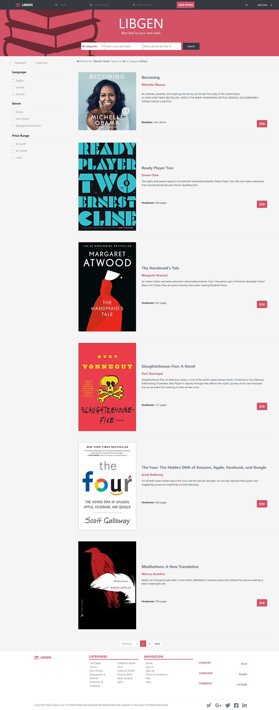

# Capstone Project NTML & CSS


> This is the HTML/CSS project #8, from the Microverse's main curriculum. It was aimed to build an online bookstore that finds the best deals available in the rest of the online bookstores known allowing to compare prices, delivery time, editions, and so forth. For that I was required to change the direction the content is being presented depending on the size of the displaying screen. I've used flexbox and the grid system built in Bootstrap.




## Built With

- HTML
- BOOTSTRAP (CSS)

## Live Demo

[Live Demo Link](https://raw.githack.com/realisticattorney/CapstoneProject/feature/index.html) 

[Author talking briefly about the project](https://www.loom.com/share/93459d0c233d4624b21ec3d689759730)

## Getting Started

To get a local copy up and running follow these simple example steps.

### Prerequisites

- Live Server plugin for Visual Studio Code 

### Setup

1- Clone the repository
```
https://github.com/realisticattorney/CapstoneProject.git
```

2- Open the folder on VS Code, right click the index.html file and click on "Open With Live Server".

3- Everything should be running by now. 


## Author

👤 **German Aquila** 
- GitHub: [@realisticattorney](https://github.com/realisticattorney) 
- Twitter: [@ContoliAxl](https://www.twitter.com/contoliaxl)
- Linkedin: [@germanaquila](https://www.linkedin.com/in/german-aquila-55a9171b5/)  

## Acknowledgement

-To the Microverse team

-And to Mohammed Awad (his Behance profile: https://www.behance.net/M_Awad) for the web design on which I based this project.

Find the original design here: https://www.behance.net/gallery/24796463/ZATTIX


## 🤝 Contributing

Contributions, issues, and feature requests are welcome!

Feel free to check the [issues page](https://www.linkedin.com/in/germanaquila/)

## Show your support

Give a ⭐️ if you like this project!

## 📝 License

This project is [MIT](./LICENSE).

